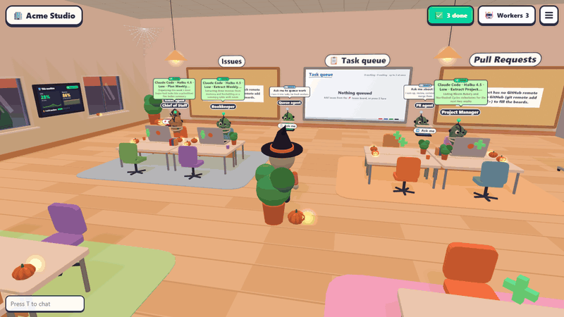
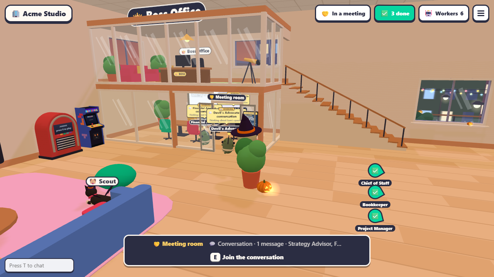
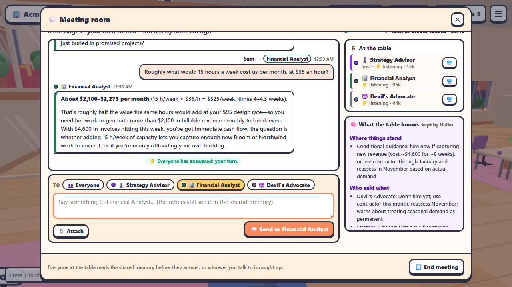
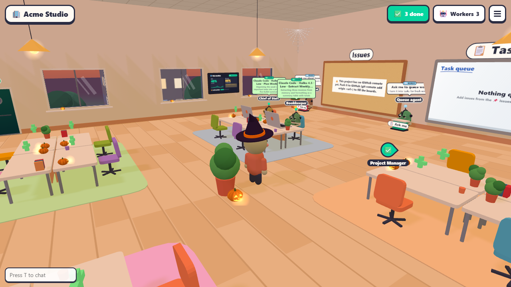

<div align="center">

# Agent Express (Fun Edition)

**Your team of Claude Code agents, in a 3D office you can walk into.**

Sit a Bookkeeper at a desk and watch her terminal on the laptop in front of her. Call three
teammates into the glass meeting room and talk it through around the table. Answer the one who's
jumping up and down because she needs you. It all runs on your own computer, on your own Claude plan,
and on your phone it's the calm [Agent Express](https://github.com/DatafyingTech/Agent-Express) app instead.

**Want it?** [Install in one line](#install). Your phone is [three taps after that](#on-your-phone).

[](LICENSE)
[](https://nodejs.org)
[](#requirements)
[](https://docs.claude.com/en/docs/claude-code)
[](https://threejs.org)

</div>

---

## What it does



*Nothing here is staged. These are real Claude Code agents in a brand-new workspace, recorded from a
real Agent Express (Fun Edition) build in one take. The three at their desks had just finished real first tasks; the
three in the meeting room wrote every word you see, and the memory panel is what Haiku actually kept.
The honest footnotes: every teammate ran on Haiku instead of the model in their brief, to keep the
recording cheap; the camera moves are scripted; and the waits while they think are sped up (up to
5x). It was October, so the office is dressed for Halloween. "Acme Studio" and "Sam" are made up.*



Every teammate is a little character at a desk, and the laptop in front of them shows their real
Claude Code terminal, live. Across the room you can tell who is reading files (a stack of papers),
who is typing flat out, who is waiting on tests (leaning back, hands behind the head) and who
needs you (jumping, and the office corgi runs over and barks at their desk).

Walk up to the meeting room, press **E**, and start **a conversation**. The teammates you pick step
out of the elevator, walk over and sit down around the table. Talk to all of them or just one;
everyone reads what the others said, and a panel called **What the table knows**, kept by Haiku,
sums up where things stand after every turn. End it, and the whole conversation is saved as a
record.



On your phone, the same team, the same chats and the same meeting are in the
[Agent Express](https://github.com/DatafyingTech/Agent-Express) app, which Agent Express (Fun Edition) includes. Open the address on a
phone and that's what you get.

### Why a 3D office?

Because a team is easier to run when you can see it. A list of terminals tells you nothing until
you read each one. A room tells you at a glance who is busy, who is stuck and who is done, and it
makes checking in on six agents something you actually want to do.

|  | Agent Express (Fun Edition) | Agent Express | A row of terminal tabs |
|---|---|---|---|
| **See the whole team at once** | Yes: desks, animations, status lights | A list with status words | Click through each tab |
| **On your phone** | Gives you the Agent Express app | Built for it | No |
| **Meetings** | Around a real table, with the memory on the wall | A conversation screen | Script it yourself |
| **Live terminals** | On each laptop; press E to open, anyone can type | Behind each chat, with a key bar | Yes |
| **Bring people in** | Walk around together, voice chat, screen share on the lounge TV | Accounts and invites | Screen-share your terminal |
| **Runs on** | Your computer, your Claude plan | Your computer, your Claude plan | Your computer, your Claude plan |

If you only want the phone app, install [Agent Express](https://github.com/DatafyingTech/Agent-Express) instead.
It's the same team, without the building.

---

## Highlights

- **A roster you can hire from.** 35 teammates in nine departments, from a Chief of Staff and a
  Software Engineer to a Meal Planner and a Money Critic, each with a job, a brief and a sensible
  model. Walk up to an empty desk and press **E**, or **☰ → Hire a crew** to seat a whole crew at
  once (Product Team, Launch Crew, Monthly Money Meeting and nine more).
- **Real terminals, shared.** Press **E** at a desk and the laptop's terminal opens full size.
  Several people can type in it at once, and someone who joins late gets the whole scrollback.
- **The meeting room.** A glass room under the boss's office with a long table. **A conversation**:
  talk to everyone at the table or only some of them, for as long as you like, with a shared memory
  on the side. Or a structured meeting: **Debate**, **Lead & team**, **Map-reduce**, **Red / blue**
  or **Review panel**, each ending in a written document committed on its own branch.
- **A floor per project.** Your workspace is the first floor. Ride the elevator to add a GitHub
  repository as a new floor, painted its own colors, with its own desks, boards and queue.
- **Boards on the walls.** GitHub issues and pull requests hang on cork boards. Take an issue's card
  off the board and carry it to a desk to hand it to a teammate. A brass gong rings and confetti
  falls when a pull request merges.
- **A task queue.** Pin tasks on the whiteboard and walk away. The next free desk takes the next
  task, in its own git worktree.
- **A shared memory.** Every floor keeps a `memory/` folder that every teammate reads before they
  answer and writes to when they learn something.
- **An office worth hanging around in.** A corgi who naps under busy desks, a jukebox, an arcade
  cabinet, coffee, a rooftop with a view, real day and night, weather, and holiday decorations in
  October and December.
- **Together.** Everyone you invite walks around the same office in real time, with proximity voice
  chat and screen sharing on the lounge TV (on the computer; see the FAQ about phones).
- **Your computer, your plan, your files.** No account with us, no server of ours, no telemetry.

---

## Requirements

|  | Minimum | Recommended |
|---|---|---|
| **OS** | Windows 10 64-bit, macOS 13, or a recent Linux | Windows 11 or macOS 14+ |
| **CPU / RAM** | Any 64-bit CPU, 8 GB | 16 GB if you run more than about five teammates at once |
| **Graphics** | Any GPU with WebGL 2 in a current browser | Anything from the last few years; integrated graphics are fine |
| **Disk** | 2 GB for the app and its packages | SSD |
| **Claude** | A Claude plan that includes Claude Code (Pro or Max), or an Anthropic API key | Max, if you keep a big team busy |
| **Node.js** | 20 | 22 LTS |
| **Git** | Any recent version | |
| **A phone** | Optional. Any iPhone or Android with a modern browser | |
| **Tailscale** | Optional, for the phone. Free for personal use | |

The installer checks for Node.js, Git, the Claude Code CLI and Tailscale, and offers to install
whichever are missing. Your computer has to be on (and awake) for your teammates to work.

---

## Install

### Windows

Open **PowerShell** (press Start, type `powershell`, press Enter) and paste:

```powershell
irm https://raw.githubusercontent.com/DatafyingTech/Agent-Express-Fun-Edition/main/install.ps1 | iex
```

Or [download the ZIP](https://github.com/DatafyingTech/Agent-Express-Fun-Edition/archive/refs/heads/main.zip),
right-click it, choose **Extract All**, open the folder and double-click **`install.bat`**.

If Windows shows **"Windows protected your PC"**, that is SmartScreen reacting to any script from
the internet: click **More info**, then **Run anyway**.

### macOS and Linux

```bash
curl -fsSL https://raw.githubusercontent.com/DatafyingTech/Agent-Express-Fun-Edition/main/install.sh | bash
```

### What the installer does

Every step is skipped when it is already done, so running it again is always safe.

1. **Checks for Node.js 20+, Git, the Claude Code CLI and Tailscale**, and offers to install what's
   missing (`winget` on Windows, Homebrew on macOS, your package manager on Linux). It asks first.
2. **Checks that Claude Code is signed in**, and offers to sign you in.
3. **Installs and builds the app** (`npm ci`, `npm run build`).
4. **Creates your workspace**, `~/AgentExpressFun` (`%USERPROFILE%\AgentExpressFun` on Windows), with a starter
   `CLAUDE.md`, a `memory/` folder and a `TODO.md`, as a git repository: that's the ground floor.
   It tells Claude Code to trust that folder (after backing up `~/.claude.json`), so the first
   teammate you hire doesn't stop at Claude Code's "Do you trust this folder?" question.
5. **Sets your sign-in password**: your own, or a generated one it shows you once. Only a hash is
   stored.
6. **Offers to start Agent Express (Fun Edition) when you sign in**, and adds Start Menu and desktop shortcuts on
   Windows.
7. **Starts it and shares it on your tailnet** with `tailscale serve`. The server itself only listens
   on `127.0.0.1`.
8. **Prints the addresses**: `http://localhost:4610` on this computer, and one for your phone.

Agent Express (Fun Edition) uses port **4610** by default, so it can run next to Agent Express (4600) on the same computer.

<details>
<summary><b>Options</b></summary>

| Windows | macOS / Linux | What it does |
|---|---|---|
| `-Port <n>` | `--port <n>` | The port on this computer (default 4610) |
| `-Workspace <dir>` | `--workspace <dir>` | Your workspace folder (default `~/AgentExpressFun`) |
| `-InstallDir <dir>` | `--install-dir <dir>` | Where the one-line install puts the app (default `%LOCALAPPDATA%\Programs\Agent-Express-Fun-Edition` / `~/.local/share/agent-express-fun`) |
| `-NoTailscale` | `--no-tailscale` | This computer only |
| `-NoAutostart` / `-Autostart` | `--no-autostart` / `--autostart` | Don't (or do) start it when you sign in, without asking |
| `-NoShortcut`, `-NoDesktopShortcut` | | No shortcuts, or Start Menu only |
| `-NoStart` | `--no-start` | Set everything up, but don't start it |
| `-ResetPassword` | `--reset-password` | Ask for a new password even if one is set |
| `-Yes` | `-y`, `--yes` | Unattended: take the default for every question |
| `-DryRun` | `--dry-run` | Report what it would do, change nothing |
| `-Force` | `--force` | Reinstall packages and rebuild |

From a downloaded copy: `install.bat -Port 4710` or `./install.sh --port 4710`. Through the
one-liner on macOS and Linux: `curl -fsSL …/install.sh | bash -s -- --port 4710`. The Windows
one-liner reads `AGENT_EXPRESS_PORT`, `AGENT_EXPRESS_WORKSPACE`, `AGENT_EXPRESS_INSTALL_DIR`, `AGENT_EXPRESS_YES=1`,
`AGENT_EXPRESS_DRY_RUN=1`, `AGENT_EXPRESS_NO_TAILSCALE=1`, `AGENT_EXPRESS_NO_AUTOSTART=1` and `AGENT_EXPRESS_PASSWORD` instead.
</details>

In the app's folder you'll find `start`, `stop`, `doctor`, `update`, `password` and `uninstall`
(`.bat` on Windows, `.sh` on macOS and Linux). Each does what it says; `doctor` checks everything and
prints a fix for each problem.

---

## First run

Open **http://localhost:4610** (or the **Agent Express (Fun Edition)** shortcut) and sign in. The first time, you pick
your character: skin, hair and shirt.

1. **Look around.** **W A S D** to walk, drag the mouse to turn, **Space** to jump. The desks are in
   the middle, the meeting room is under the boss's office on the loft, the lounge has the jukebox
   and the arcade.
2. **Hire someone.** Walk up to an empty desk and press **E**. Choose a teammate from the roster
   (say the **Chief of Staff**), give them a first task if you like, and they sit down and open
   their laptop. Or **☰ → Hire a crew** to fill several desks at once.
3. **Talk to them.** Press **E** at their desk to open the terminal and type, or open the Agent Express
   app at `/app` for a chat view.
4. **Call a meeting.** Walk into the meeting room and press **E** at the table. Choose **A
   conversation**, pick who's coming, and ask them something real. Watch them walk in and sit down.



Before all that, open `CLAUDE.md` in your workspace and tell the team about yourself. Every
teammate reads it before they start.

The [tutorial](docs/TUTORIAL.md) walks through the Agent Express app with screenshots, start to finish;
everything in it works in Agent Express (Fun Edition) too.

### Controls

| Key | Action |
|---|---|
| **W A S D** / arrows | Walk (hold Shift to run) |
| **Space** | Jump |
| Mouse drag / wheel | Turn / zoom the camera |
| **E** | Interact: hire at an empty desk, open a terminal, call a meeting, read a board, pet the dog, sit, ride the elevator… |
| **P** | Give a task to a new teammate, or the one at this desk |
| **C** | A teammate's changes: the diff, commit, discard or open a pull request |
| **N** | Go to the teammate who has waited longest for you |
| **X** | Send a teammate home |
| **R** | Wake a resting teammate |
| **T** / Enter | Chat with the people in the office |
| **/** | Search the chat and every terminal on the floor |
| **V** / **M** | Join voice / mute |
| **Tab** | The ☰ menu: every window, and what shows on screen |
| **Esc** | Close any window |
| **Ctrl + [** | Send Esc to a terminal (to interrupt Claude) |

---

## On your phone

Open the phone address the installer printed and you get the **Agent Express** app, built for one hand:
your team, their chats, conversations, notes, tasks and reports. Phones open it by themselves; on a
computer it lives at `/app`.

1. **Install [Tailscale](https://tailscale.com)** from the App Store or Google Play and sign in with
   **the same account** as on the computer.
2. **Open the address the installer printed** (like `http://my-pc.example-tailnet.ts.net:4610/app`)
   in Safari or Chrome, and sign in.
3. **Add it to your Home Screen.** iPhone: **Share → Add to Home Screen → Add**. Android: **⋮ →
   Add to Home screen** (or **Install app**).

**Adding someone else.** Share your computer with them from the [Tailscale admin
console](https://login.tailscale.com/admin/machines) (the computer's **⋯** menu → **Share…**), then
invite them in the app: **Settings → People & access → Invite someone**, or **☰ → 🔑 Accounts** in
the office. The link works once, for 7 days, and they choose their own password. Their name is on
their character, in chat and on every terminal they type into.

---

## Making it yours

- **Tell the team about you** in `CLAUDE.md` in your workspace.
- **Change the roster.** Copy `src/shared/roster.default.ts` to `src/shared/roster.local.ts` in the
  app's folder, edit the people, departments, crews and briefs, then rebuild and restart (run the
  installer again with `-Force` / `--force`). Your copy is picked up automatically, stays out of
  git, and survives updates.
- **Give them tools.** Teammates are ordinary Claude Code sessions, so your skills, MCP servers and
  the GitHub CLI are theirs too.

---

## What it costs

**Agent Express (Fun Edition) is free.** Your teammates run on **your own Claude plan** through the Claude Code CLI,
just as if you had opened that many Claude Code sessions yourself.

- **Each teammate** uses your plan while they work, on the model in their brief (Opus, Sonnet or
  Haiku), or a cheaper one you pick when you hire.
- **Haiku** writes the conversation memory, the recaps and the task cards over each worker's head.
  Structured meetings get a Sonnet recap.
- **A resting teammate costs nothing.**

**☰ → ⏳ Claude limits** shows your plan's 5-hour and weekly usage, and each worker's card shows
what it has spent. The meeting room's door shows a meeting's tokens and cost as it goes. For scale,
the meeting in the demo above, three teammates on Haiku plus the memory, came to about **10 cents**
of API-equivalent usage. The same three on their usual Opus and Sonnet would cost several times that.

---

## Privacy and your data

**Everything runs on your computer.** Chats, terminals, memory, reports, meeting records and
settings live in your workspace and the app's folder, as plain files you own. No Agent Express server, no
account with us, no telemetry, no analytics.

| What | To where | When |
|---|---|---|
| **Claude Code** | Anthropic | Whenever a teammate works, and for the Haiku memory and task cards |
| **Your phone and anyone you invite** | Your computer, through Tailscale | When they use it. Encrypted end to end by WireGuard |
| **Voice and screen sharing** | Directly between the browsers in the office (WebRTC) | Only when you turn them on |
| **Fonts** | Google Fonts | When the Agent Express app's page loads |
| **GitHub** | github.com, through the GitHub CLI | Only if you use the boards or add a floor from GitHub, and to install or update |
| **Pictures, radio, weather** | The link you paste; open-meteo.com | Only if you hang a picture from the web, play an internet radio link, or start it with `--city` |

The server listens only on `127.0.0.1`; your tailnet reaches it through `tailscale serve`, and
everyone still has to sign in.

---

## Updating and uninstalling

**Update:** double-click `update.bat` (or `./update.sh`). It fetches the newest version, rebuilds and
restarts, keeping your workspace, password, settings and `roster.local.ts`.

**Uninstall:** double-click `uninstall.bat` (or `./uninstall.sh`): it stops Agent Express (Fun Edition) and removes
the autostart, shortcuts and Tailscale share. Then delete the app's folder. Your workspace,
`~/AgentExpressFun`, is kept; delete it too if you don't want it.

---

## When something goes wrong

**Run `doctor.bat`** (or `./doctor.sh`). It checks Node.js, Git, Claude Code and its sign-in, the
build, the workspace and its trust setting, the password, the autostart, the running app and
Tailscale, and prints a fix for each problem. `doctor.bat -Force` applies the fixes it can.

<details>
<summary><b>A new teammate jumps up and down straight away</b></summary>

It's waiting on Claude Code's "Do you trust this folder?" question. Press **E** at the desk and
answer yes in the terminal. Stop Agent Express (Fun Edition) and run `doctor.bat -Force` to mark the workspace trusted
for good. A floor you add from GitHub is a new folder, so its first teammate may ask once too.
</details>

<details>
<summary><b>The office is slow or choppy</b></summary>

The 3D office needs WebGL. Use a current Chrome, Edge, Firefox or Safari, make sure hardware
acceleration is on in the browser's settings, and close other heavy tabs. On a phone, use the
Agent Express app, which is what phones get anyway.
</details>

<details>
<summary><b>Voice chat or screen sharing doesn't work from another device</b></summary>

Browsers only allow the microphone and screen capture on a secure (HTTPS) page, or on `localhost`.
They work on the computer itself. Over the tailnet the address is plain HTTP (still encrypted by
Tailscale, but the browser doesn't know that), so voice and screen sharing are off there. Everything
else works.
</details>

<details>
<summary><b>Port 4610 is already in use</b></summary>

Run the installer again with `-Port 4710` (or `--port 4710`). It moves the Tailscale share too.
</details>

Still stuck? [Open an issue](https://github.com/DatafyingTech/Agent-Express-Fun-Edition/issues) with your doctor
output (check it for anything private first).

---

## FAQ

<details>
<summary><b>What's the difference between Agent Express and Agent Express (Fun Edition)?</b></summary>

The same team, server and app. Agent Express (Fun Edition) adds the 3D office and opens it at `/`; Agent Express opens the
phone-first app everywhere. Pick the Fun Edition if you like seeing your team, or if several people will work
in the office together; pick Agent Express for a quiet app on your phone. They can run side by side.
</details>

<details>
<summary><b>Do I need an Anthropic API key?</b></summary>

No. It uses whatever Claude Code is signed in with: a Pro or Max plan, or an API key.
</details>

<details>
<summary><b>Can my teammates send emails or spend money for me?</b></summary>

Only with tools and permissions you give Claude Code. Every brief tells them to draft anything
outward-facing or hard to undo and wait for your yes, and Claude Code's own permission prompts still
apply (they show up on the laptop, and in the Agent Express app with quick answers).
</details>

<details>
<summary><b>Can I use OpenCode or Codex?</b></summary>

Yes, the office can seat Claude Code, OpenCode or Codex workers. The roster, the shared memory and
the conversation meetings are built and tested around Claude Code.
</details>

---

## Contributing

Issues and pull requests are welcome. See [CONTRIBUTING.md](CONTRIBUTING.md) for the dev setup and
[CODE_OF_CONDUCT.md](CODE_OF_CONDUCT.md). Security problems: please read [SECURITY.md](SECURITY.md)
and report privately.

## Credits

Agent Express (Fun Edition) is built on **[agent-office](https://github.com/AgentSystemLabs/agent-office)** by
AgentSystemLabs (MIT): the cartoon 3D multiplayer office, the shared terminals, the boards, the
gong, the elevator and the meeting room are its work. Agent Express (Fun Edition) adds the roster and crews, the
conversation meetings with a shared memory kept by Haiku, the Agent Express phone app, and the one-line
installers with Tailscale. Thank you.

Also built with [Claude Code](https://docs.claude.com/en/docs/claude-code),
[Three.js](https://threejs.org), [xterm.js](https://xtermjs.org),
[node-pty](https://github.com/microsoft/node-pty), [Excalidraw](https://excalidraw.com),
[Tailscale](https://tailscale.com), [Vite](https://vite.dev) and [Lucide](https://lucide.dev).

Agent Express (Fun Edition) is an independent project, not affiliated with, endorsed by or sponsored by Anthropic or
Tailscale. Claude and Claude Code are trademarks of Anthropic.

## License

[MIT](LICENSE). The original agent-office copyright notice is kept in [LICENSE](LICENSE), as its
license asks.
