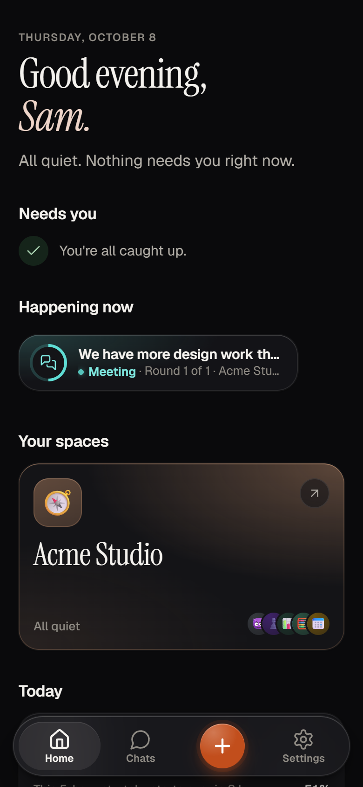
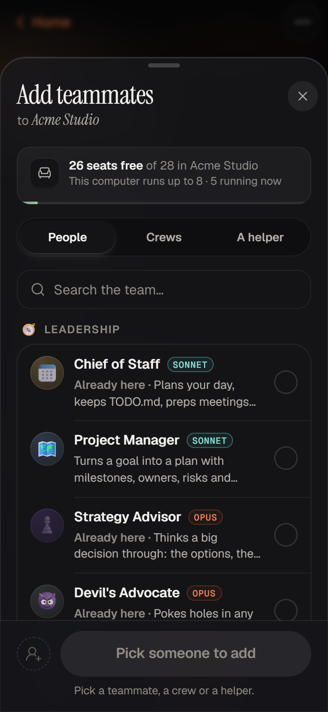
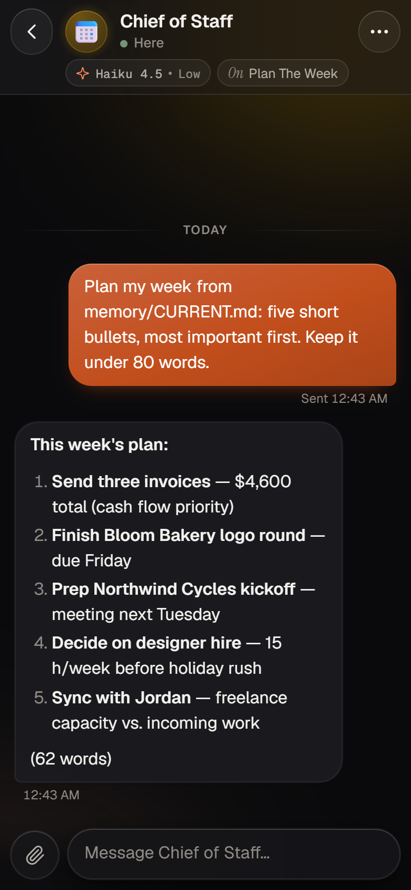
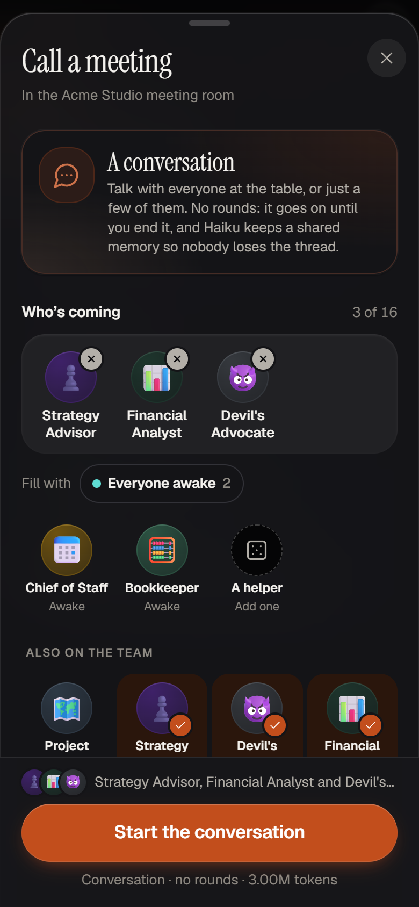
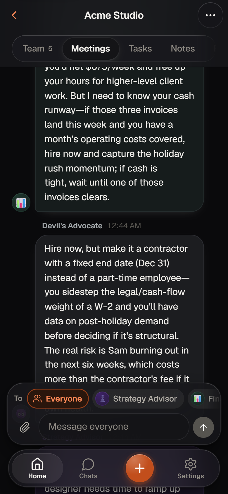
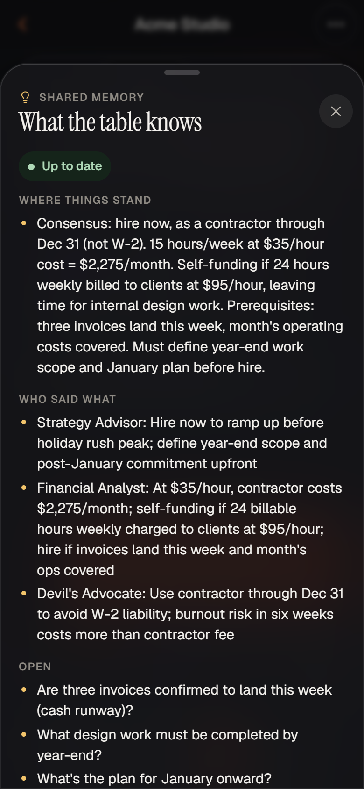
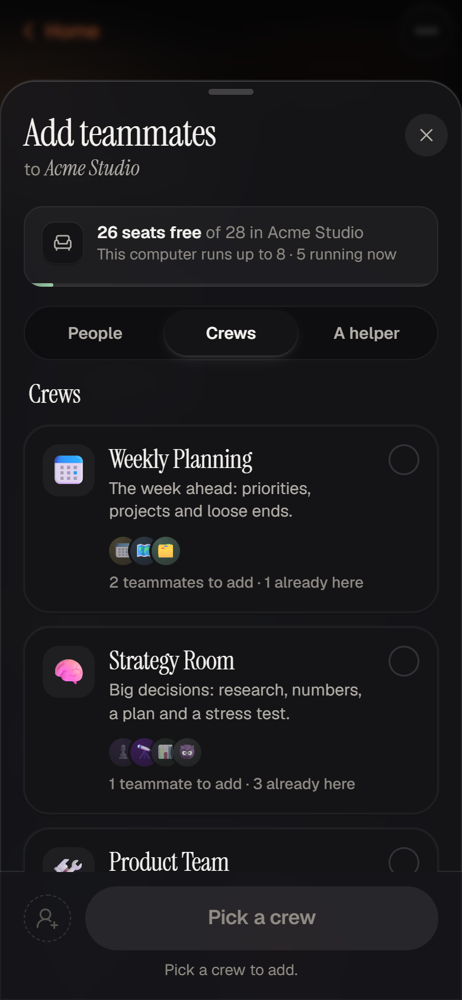

# Your first hour with Hearth

This walks you from a fresh install to a small team that knows you, answers on your phone, and
talks things through together. It takes about an hour, most of it reading what your teammates
write back.

The screenshots come from a real install with a made-up company, **Acme Studio**, run by a
made-up person, **Sam**. Your names will be yours.

> **Hearth HQ?** Everything here works the same in Hearth HQ. Open the app part at
> `http://localhost:4610/app` on the computer (phones get it automatically), or do the same things
> in the 3D office: the tips marked **In HQ** say how.

**What you need:** Hearth installed (see the [README](../README.md#install)) and your password.
Optional: a phone with Tailscale for step 5.

---

## 1. Sign in and look around

Open **http://localhost:4600** on the computer that runs Hearth and sign in with the password you
chose during install.

This is **Home**. It greets you, lists anyone who **needs you** (nobody yet), and shows **your
spaces**. A space is one folder your team works in, with its own teammates, notes and tasks. The
installer made your first one: your workspace, `~/Hearth`.

At the bottom (or down the side on a wide screen) are **Home**, **Chats**, **Settings**, and the
round **✚** button, which is the quickest way to do almost anything: message someone, call a
meeting, add a teammate or add a task.

**Before you hire anyone,** open `CLAUDE.md` in your workspace folder in any text editor and fill in
the few lines about you: your name, what you do, your time zone, and how you like to work. Every
teammate reads that file before they start, so this is the single most useful minute you'll spend.

---

## 2. Hire your first teammate

Tap **✚ → Add a teammate**. The sheet has three tabs:

- **People**: the whole roster, grouped by department. Search it, or scroll.
- **Crews**: groups that work well together (more on those in step 6).
- **A helper**: a general-purpose agent with a job you describe in a line.

Pick the **Chief of Staff**. You can give them a first message right here, or leave it empty and
say hello in a moment. Under **Model & effort** you can choose a different model for them; leave it
on **Usual** for now (their brief picks a sensible one). Tap **Add Chief of Staff**.

They appear in your space as **Getting settled…** while Claude Code starts up, then **Ready**.

> **In HQ:** walk up to an empty desk and press **E**, pick **Chief of Staff** under **Teammate**,
> and hire. They walk in, sit down and open their laptop.

> **If they show "Needs you" straight away**, Claude Code is asking whether it may trust the
> folder. Open their chat: the card shows the question with **Quick answers**. Tap the yes answer.
> The installer normally prevents this for your workspace; `doctor` fixes it for good.

---

## 3. Your first chat

Tap the Chief of Staff. Say something real:

> Hi! I run Acme Studio, a two-person design studio. This week I need to send three client
> invoices, finish the Bloom Bakery logo, and hire a part-time designer. Help me plan the week.

While they work, the line under their name says what they're doing. When they reply, it's a
normal message. A few things worth knowing:

- **Attach things.** The paperclip takes photos and PDFs: a receipt, a screenshot, a letter. On a
  computer you can also paste or drag them in. Your teammate reads them from the space's
  `attachments/` folder.
- **They remember.** Anything worth keeping, they write into the space's shared memory, the
  `memory/` folder. Every teammate reads its summary with every message, so you don't have to
  repeat yourself to the next person.
- **They ask before anything that matters.** Sending, posting, paying or deleting: their brief tells
  them to draft it and wait for your yes. When they need you, they show up under **Needs you** on
  Home, with a clay dot.
- **Behind the scenes.** Tap their name at the top for more: **Terminal** opens the real Claude Code
  terminal (with a key bar on phones), **Changes** shows the files they changed, and **Send home**
  lets them go.

---

## 4. A conversation meeting

One teammate is useful. A few who can hear each other are better.

Tap **✚ → Call a meeting**. The top card is **A conversation**: no rounds and no rules, just you and
the people you pick, for as long as you like.

You don't have to hire anyone first. Under **Who's coming**, tap **More people** and pick from the
whole roster: here, the **Strategy Advisor**, the **Financial Analyst** and the **Devil's
Advocate**. They come to the table just for this meeting. (**Everyone awake** seats the teammates
you've already hired instead.) Then write your opening message and tap **Start the conversation**:

> We have more design work than I can finish. Should Acme Studio hire a part-time designer now, or
> wait until after the holidays?

They answer one at a time, and each one reads what the others said before answering, so you get a
discussion, not three separate essays. Now the two things that make it work:

**Talk to just one of them.** Under the conversation, the **To** row starts on **Everyone**. Tap
one name instead, say the Devil's Advocate, and ask:

> What's the strongest argument against hiring now?

Only they answer. The others still see it.

**What the table knows.** At the top of the conversation is a small card, **What the table knows**.
After every turn, Claude Haiku (the small, cheap model) rewrites it: where things stand, what's
decided, what's still open. Every seat reads it before they answer, which is why whoever you talk to
is already caught up. Tap it to read it in full.

When you're done, tap **End** → **End meeting**. Haiku writes a short recap, and the whole
conversation is saved. You'll find it under **Meetings → Earlier meetings** and in **Reports**.

> **Want something more structured?** In **Call a meeting**, choose **Or run a structured
> meeting**: a **Debate** that ends in a written decision, **Lead & team** for splitting a job up,
> **Divide & combine** for the same task over many parts, **Red / blue** to attack and fix a plan,
> or a **Review panel** for a pull request. When it's over, ask the lead **Follow-ups**.

> **In HQ:** walk into the glass meeting room under the boss's office and press **E** at the table.
> Your teammates get up from their desks, walk in and sit down. The conversation window has the
> same **To** row and the **What the table knows** panel, kept by Haiku.

---

## 5. On your phone

This is where Hearth earns its keep: your team, in your pocket, while the work happens on your
computer.

1. **Install Tailscale** on your phone (App Store or Google Play) and sign in with **the same
   account** you used on the computer during install.
2. **Open the address the installer printed** (it ends in `:4600/app`; `doctor` prints it again,
   and so does **Settings → About** on the computer). Use Safari on an iPhone, Chrome on Android.
   Sign in with your password.
3. **Add it to your Home Screen** so it opens full screen, like an app:
   - **iPhone:** tap **Share** (the square with an arrow), scroll down, **Add to Home Screen**,
     then **Add**.
   - **Android:** tap **⋮**, then **Add to Home screen** (or **Install app**), then **Add**.

Now try it away from your desk. Open the conversation from step 4 and ask the Chief of Staff
something with the **To** row. Or open a chat, tap the paperclip and take a photo of a receipt:
"File this under October expenses."

Your computer has to be on and awake. Everything travels over Tailscale, privately between your
own devices; nothing is opened to the internet.

**Someone else's phone:** share your computer with them in the Tailscale admin console (the
computer's **⋯ → Share…**), then make them an account in Hearth: **Settings → People & access →
Invite someone**. They open the link, pick a password, and they're in under their own name.

---

## 6. A crew

Some jobs are a team sport. A **crew** is a group of teammates who sit down together, each told who
the others are and which part is theirs.

Tap **✚ → Add a teammate → Crews**.

Pick **Weekly Planning** (the Chief of Staff, the Project Manager and the Operations Manager), give
them one task, and add them:

> Plan Acme Studio's next two weeks: invoices, the Bloom Bakery logo, and the designer hire.

Each one takes their own part. Watch the space's **Team** list: their status lines say who is
working on what, and you'll find their results in their chats, in **Notes**, and in **Reports** when
they make one.

A few crews to try next: **Home Team** for chores, the family calendar, meals and gifts; **Monthly
Money Meeting** for the household budget review; **Product Team** if your space is a code
project.

> **In HQ:** **☰ → Hire a crew** seats them at desks next to each other.

---

## 7. Where everything lives

Open a space and look along the top:

| Tab | What's there |
|---|---|
| **Team** | Everyone in this space, grouped as Needs you, Working, Ready and Resting |
| **Meetings** | The live meeting, and **Earlier meetings** |
| **Tasks** | A queue: describe a task, and the next free teammate takes it |
| **Notes** | **What the team knows**: the shared memory, in plain words. **Tell the team something** adds to it |
| **Reports** | Pages, charts and PDFs your teammates made, and meeting records |
| **GitHub** | Issues, pull requests and running dev servers, when the space is a GitHub repository |

And in **Settings**: **Usage & limits** (what the team has spent, and your Claude plan's windows),
**People & access** (invites), **Spaces** (which show on this device, and **Add a space from
GitHub**), **Notifications** (a Slack or Discord webhook for when someone needs you), and
**Appearance** (light, dark or auto).

---

## Where to go from here

- **Make the team yours.** Copy `src/shared/roster.default.ts` to `roster.local.ts` in the app's
  folder, rename people, change their focus, add a department or a crew, and rebuild. The README's
  [Making it yours](../README.md#making-it-yours) section has the details.
- **Give them tools.** Skills and MCP servers you install for Claude Code are theirs too.
- **Keep an eye on cost.** Rest teammates you aren't using (they cost nothing asleep), and pick
  Haiku or Sonnet for the ones doing simple work.
- **Something odd?** Run `doctor.bat` (or `./doctor.sh`) and read what it says.
